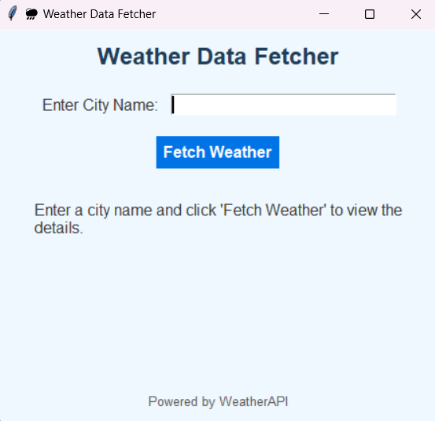
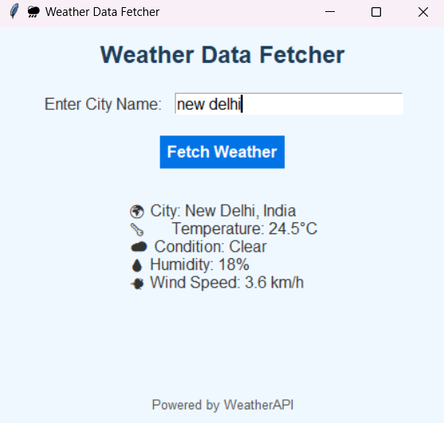

# 🌦️ Weather Data Fetcher

**Weather Data Fetcher** is a Python-based desktop application that fetches current weather data for any city using the [WeatherAPI](https://www.weatherapi.com/). Built with `tkinter`, it provides a simple, user-friendly interface to display real-time weather information.

---

## 📋 Features

- **City Input**: Enter any city to fetch its current weather details.
- **Weather Details**:
  - 🌡️ Temperature (°C)
  - ☁️ Weather Condition
  - 💧 Humidity (%)
  - 💨 Wind Speed (km/h)
- **Error Handling**:
  - Alerts for invalid inputs or network issues.
  - Descriptive error messages for API failures.
- **Modern Design**: Clean and intuitive interface with responsive layouts.

---

## 🛠️ Installation and Setup

### Prerequisites
- Python 3.8 or later installed.
- `requests` library installed:
  ```bash
  pip install requests
  ```

### Setup Instructions
1. Clone or download this repository.
2. Obtain a free API key from [WeatherAPI](https://www.weatherapi.com/).
3. Replace the `api_key` in the script with your WeatherAPI key:
   ```python
   api_key = "YOUR_API_KEY"
   ```
4. Run the script:
   ```bash
   python weather_fetcher.py
   ```

---

## 🚀 Usage

1. Launch the application.
2. Enter a city name in the input field.
3. Click the **"Fetch Weather"** button.
4. View the current weather details displayed below.

---

## 🖥️ Application Preview

### Interface


### Desired Result


---

## 📂 File Structure
```
.
├── weather_fetcher.py   # Main application script
├── README.md            # Documentation file
└── requirements.txt     # Python dependencies
```

---

## 🤔 Troubleshooting

- **No API Key or Invalid Key**:
  Ensure you've replaced the placeholder API key with a valid key from WeatherAPI.
  
- **Network Issues**:
  Check your internet connection and try again.

- **Invalid City Name**:
  Double-check the spelling or try searching for nearby major cities.

---

## 💡 Future Enhancements

- Add support for multiple weather providers.
- Include forecast data for the next few days.
- Implement location auto-detection using IP geolocation.

---

## 📜 License

This project is licensed under the MIT License. See `LICENSE` for more details.

---

## ❤️ Acknowledgments

- **[WeatherAPI](https://www.weatherapi.com/)** for providing weather data.
- Python community for their amazing tools and libraries.

--- 

If you have any feedback or suggestions, feel free to reach out! 😊
